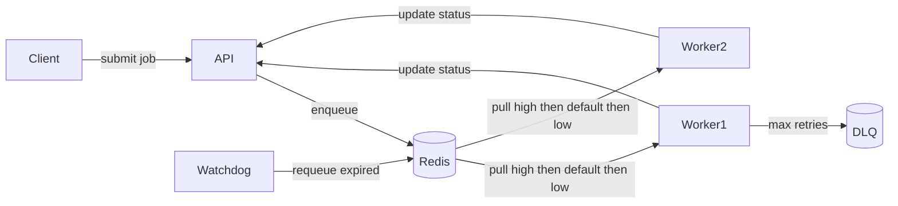

# Queuey — A Distributed Job Queue System (FastAPI + Redis + Docker)

[](../../actions)

Queuey is a **minimal but complete distributed job queue system**, inspired by tools like Celery or Sidekiq.  
It demonstrates **distributed systems principles** such as decoupling, fault tolerance, retries, and scalability, while being easy to run locally with Docker.

---

## Features
- **FastAPI REST API**: Submit and track background jobs
- **Worker service**: Executes jobs with retries, exponential backoff, and a Dead Letter Queue (DLQ)
- **Watchdog service**: Implements **visibility timeout** to prevent job loss if workers crash
- **Priority Queues**: High / Default / Low priority scheduling
- **Observability**: Can expose metrics for Prometheus + Grafana dashboards
- **Load testing**: k6 scripts to validate throughput and latency
- **Docker Compose**: Run the full system with a single command
- **CI/CD**: GitHub Actions workflow with automated smoke tests

---

## Architecture


- The API, Workers, and Redis are loosely coupled (can scale independently).
- Workers can be horizontally scaled (run N workers to increase throughput).
- Reliability is achieved through retries, DLQ, and watchdog lease requeueing.

---
## System Design
1. Redis
- Uses Redis lists (RPUSH, BLPOP) for atomic, FIFO queue operations.
- Multiple queues (queue:high, queue:default, queue:low) enable priority scheduling by polling in order of importance.
- Advantage: lightweight and fast. Trade-off: Redis is a single point of failure unless clustered.
2. Workers
- Workers continuously poll queues in order: BLPOP [high, default, low].
- Each job is marked as running with a lease key in Redis (TTL = 30s).
- If a worker crashes, the lease expires and the watchdog requeues the job.
3. Reliability
- Retries: Jobs failing temporarily are retried with exponential backoff + jitter.
- Dead Letter Queue (DLQ): Jobs that exceed max_attempts are sent to queue:dlq for later inspection.
- Dedupe keys: Prevent duplicate jobs from being enqueued (idempotency).
4. Priority Scheduling
- High-priority jobs always preempt lower-priority jobs.
- Demonstrated by submitting a low-priority job first, then a high-priority job — the worker processes the high job first.
5. Observability
- /v1/queues/metrics reports queue depths.
- Supports Prometheus + Grafana dashboards.(Use `docker-compose.override.yml` to run Prometheus (9090) and Grafana (3000))
- Metrics to expose:
  - `queue_depth{queue="high|default|low|dlq"}`
  - `jobs_processed_total{status="success|failure"}`
  - `job_latency_seconds` histogram
6. Design choices
- At-least-once delivery: Jobs may be retried, so side-effectful jobs must be idempotent.
- Exactly-once delivery not guaranteed: Requires more complex consensus/storage systems.
- Redis chosen over a database: Faster queue operations, but less durable than Postgres/Kafka.
- FastAPI chosen: Lightweight, async-ready API layer; easier to extend with new endpoints.
- Dockerized: Simplifies local development, mirrors production containerized setups.

---
## Prerequisites: Docker / Docker Compose


---
## Quickstart
1. Clone and start
```
git clone https://github.com/<your-username>/queuey.git
cd queuey
docker compose up --build
```
2. Submit a job
```
curl -X POST http://localhost:8000/v1/jobs \
  -H "Content-Type: application/json" \
  -d '{"type":"text.reverse","payload":{"text":"hello"}}'
```
  Response:
  ```
  {"job_id": "e9530532-3dcb-4c39-82c3-22ea2e2b1612"}
  ```
3. Check job status
```
curl http://localhost:8000/v1/jobs/<job_id>
```

---

## API Summary

- `POST /v1/jobs` → Create a job. Body:
  ```json
  {"type":"text.reverse","payload":{"text":"hello"},"dedupe_key":"file123:200x200"}
  ```
  Returns: `{"job_id":"..."}`

- `GET /v1/jobs/{id}` → Get job status/result

- `GET /v1/queues/metrics` → Queue lengths

- `POST /v1/replay-dlq?limit=N` → Requeue items from DLQ (header `x-api-key` required)

---

## Priority Queue Demo

Jobs can be submitted with priority.
Workers always consume high > default > low.
```
curl -X POST http://localhost:8000/v1/jobs \
  -H "Content-Type: application/json" \
  -d '{"type":"text.reverse","payload":{"text":"LOW priority"},"priority":"low"}'
```
```
curl -X POST http://localhost:8000/v1/jobs \
  -H "Content-Type: application/json" \
  -d '{"type":"text.reverse","payload":{"text":"HIGH priority"},"priority":"high"}'
```


---

## Observability
Metrics exposed by /v1/queues/metrics:
```
{
  "queue_high_length": 0,
  "queue_default_length": 2,
  "queue_low_length": 1,
  "queue_dlq_length": 0
}
```
---

## Load Testing
k6 script included under `load/k6-submit.js.`
```
brew install k6   # macOS
k6 run load/k6-submit.js
```
Observe:
- Success rate (>99%)
- Latency (p95 ideally <2s with 5 workers @100RPS)
- Scaling behavior with more workers
---
## Development & CI
- Local dev: `docker compose up --build`
- Logs: `docker compose logs -f worker`
- Tests: `pytest`
- CI: GitHub Actions (`.github/workflows/ci.yml`) runs smoke tests
- Agile tracking: GitHub Project Board with Issues linked to PRs

---
## Roadmap
- Full Prometheus metrics in API/Worker (/metrics)
- Pluggable job types (image resize, OCR, webhooks)
- Scheduled jobs (Cron support)
- Web UI for job browsing and DLQ replay
- Cloud deployment: AWS ECS + RDS + ElastiCache (Terraform)

---
## Why this project?
This project is a portfolio-grade demonstration of distributed systems engineering:
- Scalability: add workers to process more jobs
- Reliability: retries, DLQ, watchdog
- Prioritization: handle critical jobs first
- Observability: metrics and dashboards
- DevOps practices: CI/CD, Docker, Agile workflows

## License

MIT
